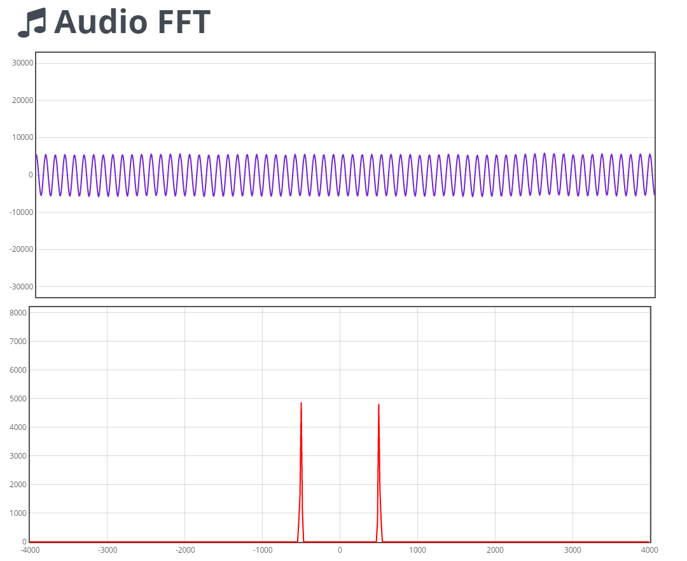
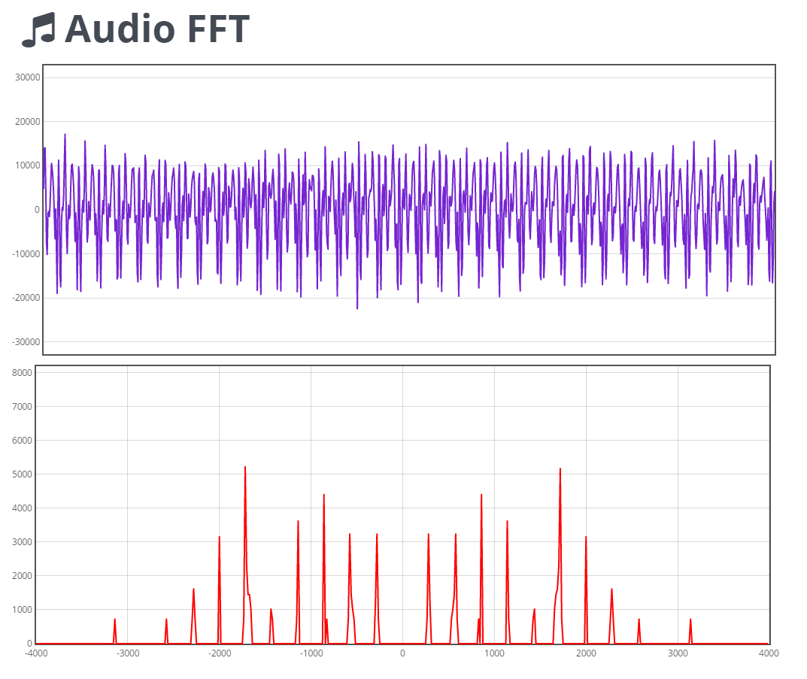

Real-Time Audio FFT
===================

Performs Real-Time FFT of audio input signal from the on-board MP45DT02 MEMS microphone. The input audio data and its FFT data are multiplexed on the left and right channels respectively. 
This data is then streamed over serial port. We use the USB CDC Virtual COM Port stack for serial communication. The raw data can be directly stored to a file and imported in a tool like [Audacity](http://www.audacityteam.org/) 
for analysis or you can use the accompanied [utility](utility/) which plots this data realtime using WebSockets.

##### Waveforms

500Hz Audio Signal                    |  Music Signal
:------------------------------------:|:----------------------------------------:
             |  

Specs

- Processor Frequency = 168MHz
- Audio Sampling Rate = 8KHz
- Sampling Resolution = 16bit
- FFT Sample Size     = 512

Source

- [Firmware for STM32F4 Discovery](firmware/)
- [Frontend Utility](utility/)

To store serial data to a file on windows use the command -

`type com9: >> output.pcm`